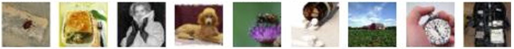
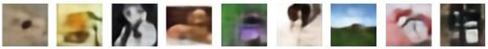
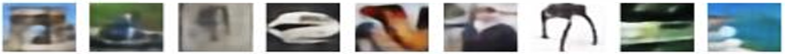

# Variational Autoencoder (VAE) for Image Generation

## Project Overview
This repository contains my implementation of a Variational Autoencoder (VAE) for a machine learning course assignment on generative models. The VAE is trained on the Tiny ImageNet dataset to learn a meaningful latent representation of images and generate new images from this latent space.

## Task Description
The assignment required implementing a generative model that:
- Takes a vector z from the latent space as input and produces an image
- Uses transposed convolutions for upscaling in the decoder/generator
- Visualizes the generated images and latent space
- Works with the Tiny ImageNet dataset (with images no smaller than 64x64)

## My Implementation

### Model Architecture
I implemented a 4-layer VAE with the following components:

#### Encoder
- 4 convolutional layers with increasing channel dimensions (3→64→128→256→512)
- ReLU activations
- Downsampling using stride=2
- Linear layers to produce latent mean (μ) and log variance (logσ²)

#### Latent Space
- 128-dimensional latent space
- Reparameterization trick for backpropagation

#### Decoder
- Linear layer to reshape latent vector
- 4 transposed convolutional layers with decreasing channel dimensions (512→256→128→64→3)
- ReLU activations for hidden layers
- Sigmoid activation for the output layer

### Training Process
- Dataset: Tiny ImageNet (200 classes, 64x64 RGB images)
- Loss function: Reconstruction loss (MSE) + KL divergence
- Optimizer: Adam with learning rate 0.001
- Progressive KL weight annealing during training
- Batch size: 64
- Training epochs: 20

## Results

The model successfully:
1. Learns a meaningful latent representation of the image data
2. Generates new images by sampling from the latent space
3. Enables smooth interpolation between different images in the latent space

The training metrics show:
- Decreasing reconstruction loss over time
- Controlled KL divergence through annealing
- Stable overall training process

## Technologies Used
- PyTorch: Deep learning framework
- torchvision: For dataset handling and transformations
- matplotlib: For visualization
- CUDA: For GPU acceleration (when available)

## Skills Demonstrated
- Deep learning architecture design
- Implementation of variational autoencoders
- Working with convolutional and transposed convolutional layers
- Latent space representation and sampling
- Image generation and interpolation
- Loss function design and optimization
- Training process monitoring and visualization
- Working with image datasets
  
## Reconstruction of existing image examples
original images:

reconstruction:

original images:

reconstruction:

